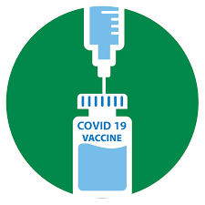

<h1 style="text-align:center;color:#008EDC">Project Lightspeed  (InnovateNSUT Hackathon)</h1>

<h3 style="text-align:center;color:#F2CA25">Team: <span style="color:white">Lightspeed </span></h1>

<br/>
Here is our youtube link to demo of our website : https://youtu.be/EZsZ8OVHTHg
<br/>The Lightspeed project was created specifically for Innovate NSUT hackathon. 
With vaccines being produced to restore the balance to the havoc created, the distribution and its roll-out is rather a difficult process.

This International Vaccine Distribution project deals with the transfer of the different vaccines amongst the differnet countries with heavy focus on human values and equitable distribution of available resources.
<br/>

## **Prerequisites**
- NodeJS
- npm

## **Build and go live**
#### How to run project:

**1- Clone the Repository**
```bash

git clone https://github.com/krush11/Project_Lightspeed

```

**2- Head to the Root Folder**
```
cd Project_Lightspeed
```

**3- Run the Following Command**
```
npm install
npm start
```

Go to `localhost:8000` or `127.0.0.1:8000` to see the website live


   
   
     
   Since Covid-19 has taken the world by storm, it is important to obey the social distancing safety norms put forward for our safety.
   Stay Safe and stay protected.


   **<h2 align="center"> Made by <a href="https://github.com/krush11/Project_Lightspeed">Team Lightspeed</a> With 💜. </h2>**
